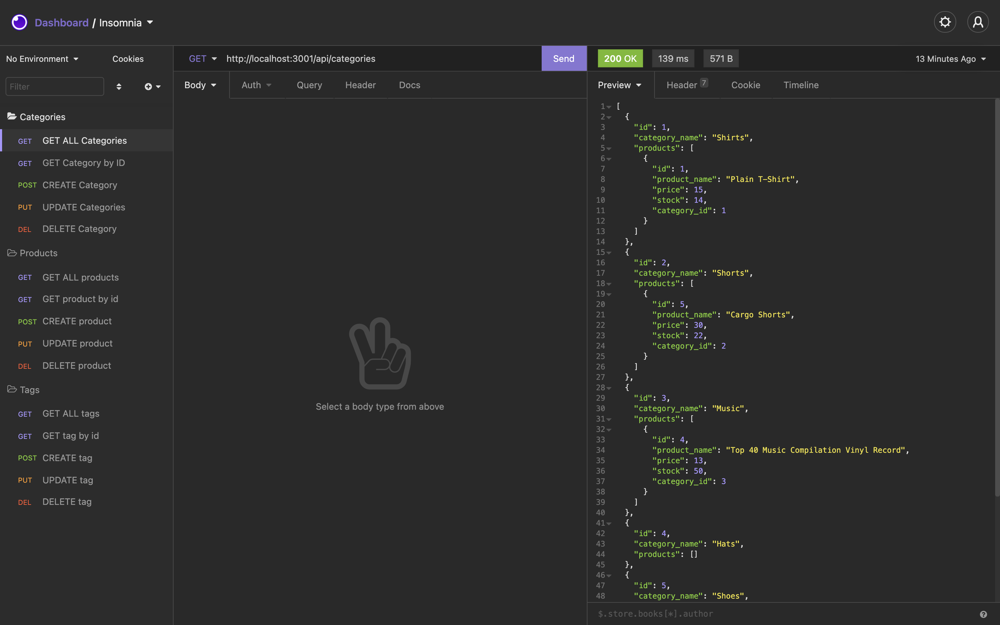

# e-commerce-back-end

## User Story
  
```
AS A manager at an internet retail company
I WANT a back end for my e-commerce website that uses the latest technologies
SO THAT my company can compete with other e-commerce companies

```

## Description
  This application helps users the to setup thier business database, categories, products, and tags. Merchandise info can be created, updated, and deleted for the business use.
## Video 
[Click here for Video](https://mr91217.github.io/e-commerce-back-end/)
## Screenshot

## Table of Contents
- [Description](#description)
- [Video Link](#Video)
- [Installation](#installation)
- [Usage](#usage)
- [Languages](#languages)
- [Contributing](#contributing)
- [Reference](#reference)
- [Questions](#questions)
## Installation
  `npm init -y`
  
  `npm install express dotenv mysql2 sequelize`
## Usage
  Run the following command at th root of your project and answer the prompted questions:<br />

  `npm start`

  
## Languages
  JavaScript,Node,Express,MySQL
## Contributing
  ChunYu Chang
## Reference
  
## Questions
 Contact me<br />

## Contact
GitHub: [mr91217](https://github.com/mr91217)<br />
<br />
Email: mr91217@gmail.com<br />
<br />